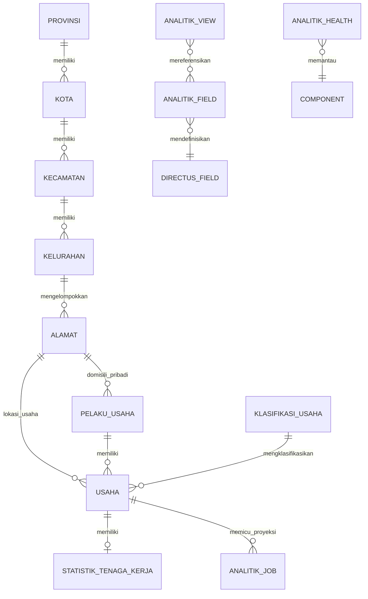

# Domain Model dan Glossary Analitik

**Status:** baseline domain disetujui
**Sumber:** schema repository, deployment Directus, dan keputusan discovery

## 1. Prinsip domain

1. Grain analitik utama adalah **satu usaha**, bukan satu pelaku usaha, NIB, alamat, atau row tenaga kerja.
2. Identitas hitung adalah `COUNT DISTINCT usaha.id`; `sumber_id` adalah source key bila tersedia dan bukan counting key.
3. Geography berarti **lokasi usaha**, bukan domisili pelaku usaha.
4. Semua angka merepresentasikan current state sampai tersedia model histori.
5. Missing, invalid, dan unmapped adalah informasi domain; record tidak boleh dibuang diam-diam.
6. Relasi one-to-many/many-to-many tidak boleh menggandakan jumlah usaha.
7. Definisi metrik berada pada semantic registry, bukan tersebar di komponen UI.

## 2. Model konseptual



Entitas program/outcome berada di roadmap dan tidak ikut menghitung MVP.

## 3. Entitas inti

### `usaha`

Grain fakta utama. Satu record mewakili satu business/source record.

Atribut penting saat ini:

- `id` — UUID internal dan identifier URL profil;
- `sumber_id` — identifier sumber non-null yang dipakai ingest untuk deduplikasi; availability/uniqueness-nya tetap quality rule dan bukan counting key;
- `nib` — identifier bisnis yang dapat kosong; normalization/collision diperiksa sebagai kualitas dan bukan counting key;
- `nama`;
- `pelaku_usaha`;
- `klasifikasi`/KBLI;
- `status_badan_hukum`;
- `skala`;
- `modal_pendirian`, `omzet_tahunan`, `total_aset`;
- bulan/tahun mulai operasi;
- `alamat`, latitude, longitude, foto;
- status archive dan timestamp Directus.

### `pelaku_usaha`

Pemilik/pelaku yang dapat memiliki beberapa usaha. Memuat data personal seperti nama, NIK, gender, disabilitas, tanggal lahir, pendidikan, telepon, dan domisili. Entitas ini bukan grain hitung UMKM dan tunduk pada aturan privasi ketat.

### Hierarki geography

```text
Provinsi → Kabupaten/Kota → Kecamatan → Desa/Kelurahan → Alamat usaha
```

- Scope produk: lokasi usaha di Jawa Barat.
- Record yang tidak dapat dipetakan harus masuk bucket eksplisit **Belum/Tidak diketahui**.
- Implementasi sebaiknya tidak memakai inner join yang membuang missing geography tanpa coverage.

### `klasifikasi_usaha`

Menyediakan kode KBLI, kategori sumber, dan deskripsi. Hierarki analitik resmi:

```text
Sektor A–U → Divisi dua digit → Kode KBLI lengkap → Usaha
```

Daftar sektor A–U mengikuti `kategori.md` sampai tersedia reference table yang dikelola.

### `statistik_tenaga_kerja`

Satu row per usaha dengan kombinasi:

- dibayar/tidak dibayar;
- laki-laki/perempuan;
- label disabilitas dibayar/tidak dibayar.

Belum terbukti apakah kolom disabilitas merupakan subset atau headcount tambahan. Metrik total tenaga kerja harus berstatus **blocked** sampai semantik sumber dikonfirmasi.

## 4. Entitas target Analitik

### `analitik_field`

Semantic registry untuk seluruh field yang dapat muncul pada query atau profil.

| Atribut | Tujuan |
|---|---|
| `collection`, `field` | Referensi field Directus sumber |
| `label`, `description` | Istilah pengguna dan definisi bisnis |
| `semantic_role` | `metric`, `dimension`, `identifier`, atau `profile_only` |
| `data_type` | Tipe normalisasi untuk query/renderer |
| `group` | Wilayah, Profil Usaha, KBLI, Tenaga Kerja, Kualitas Data, Informasi Tambahan |
| `status` | `discovered`, `classified`/`quarantined`, `projected`, `active`, `disabled`, `deleted` |
| `allowed_aggregations` | Agregasi yang aman |
| `default_aggregation` | Default jika ada |
| `format`, `unit` | Rupiah, persen, bilangan, tanggal, dan lain-lain |
| `null_policy` | Cara missing dihitung dan ditampilkan |
| `privacy_class` | `internal`, `sensitive`, atau `restricted` |
| `masking_rule` | Aturan masking bila diperlukan |
| `filterable`, `groupable`, `exportable` | Kapabilitas field |
| `high_cardinality` | Pencegahan grafik tidak terkendali |
| `profile_visibility` | Apakah tampil pada profil |
| `sort_order` | Urutan dalam picker/profile |

Field baru otomatis diregistrasikan. Field sensitif/ambigu boleh muncul pada katalog sebagai quarantined tetapi tidak boleh masuk query, profil, atau ekspor sampai kebijakannya aman.

### `analitik_view`

Saved analysis milik application user. Menyimpan nama, config JSON terversi, dan timestamp. Referensi field memakai primary key registry yang immutable, bukan nama kolom fisik. Saved analysis tidak menyimpan angka lama, shortlist, catatan, atau kesimpulan; hasil selalu dihitung dari current state terbaru.

### `analitik_job`

PostgreSQL outbox dan job queue untuk proyeksi perubahan, rebuild, rekonsiliasi, dan ekspor. Detail ada di operations runbook.

### `analitik_health`

Satu tempat bagi health dan incident dengan `record_type`:

- `component_status` — heartbeat/status terakhir komponen;
- `incident` — warning/error yang dideduplikasi;
- `reconciliation` — hasil perbandingan sumber versus read model.

Recovery menyelesaikan incident yang sama, bukan membuat collection terpisah.

## 5. Metric dictionary

### Jumlah UMKM

```text
COUNT DISTINCT usaha.id
```

Syarat:

- scope geography mengikuti lokasi usaha;
- default hanya record aktif/non-archived;
- bucket missing/unmapped tetap masuk total bila masih dalam scope;
- join relasi tidak boleh menggandakan count.

### Share UMKM

```text
jumlah UMKM pada kelompok / jumlah UMKM dalam seluruh filter aktif × 100%
```

Denominator adalah hasil filter, bukan kelompok terbesar. UI harus menampilkan denominator dan coverage.

### Selisih

```text
nilai kelompok A - nilai kelompok B
```

Selisih pada current snapshot. Tidak boleh disebut pertumbuhan.

### Skala usaha

Dimensi `micro | small | medium` berasal dari `skala_usaha` sumber dan dilabeli sebagai **skala yang dilaporkan**. Sistem tidak menghitung ulang skala dari omzet/aset secara diam-diam. Null atau inkonsistensi menjadi quality flag.

### Nilai finansial

Field:

- modal pendirian;
- omzet tahunan;
- total aset.

Default analitik: coverage, distribusi, median, average, min, max. `SUM` hanya diaktifkan setelah metadata menandai field additive dan kualitas nilainya memadai. Nilai profil diberi status **dilaporkan**, **belum tersedia**, atau **perlu verifikasi**.

### Tenaga kerja

Status: **blocked pending source semantics**.

Tidak boleh menjumlahkan kolom disabilitas dengan total paid/unpaid sebelum dibuktikan bahwa headcount-nya disjoint. Missing tidak boleh otomatis diperlakukan sebagai true zero dalam definisi metrik baru.

### Data quality

Empat dimensi awal:

1. **Completeness** — field wajib terisi.
2. **Validity** — tipe, enum, range, dan reference valid.
3. **Uniqueness** — tidak ada duplikasi key sesuai kebijakan (`sumber_id`; NIB dilaporkan terpisah).
4. **Mappability** — geography, KBLI, dan skala dapat dipetakan.

Rumus umum:

```text
quality issue rate = record bermasalah / record dalam filter × 100%
```

Default warning `>5%`; high warning `>20%`.

### Outlier

Outlier numerik menggunakan IQR:

```text
lower = Q1 - 1.5 × IQR
upper = Q3 + 1.5 × IQR
```

Outlier adalah sinyal pemeriksaan, bukan bukti kesalahan.

## 6. Aturan otomatis tipe field

| Tipe sumber | Default semantic behavior |
|---|---|
| Text/enum/boolean/date | Dimension/filter |
| Number/currency | Kandidat metric; tidak otomatis `SUM` |
| UUID/NIK/telepon/NIB | Identifier; filter/detail sesuai privacy, bukan metric |
| File/image | Profile only |
| Geometry | Map bila valid dan diizinkan |
| M2O | Dimension melalui label yang dikonfigurasi |
| O2M/M2M | Wajib `COUNT DISTINCT usaha`; perlu definisi grain |
| HTML/script | Tidak pernah dirender sebagai markup aktif |

Cardinality guard:

- maksimal 20 kategori pada bar/stacked chart;
- donut maksimal enam;
- sisanya menjadi **Lainnya**;
- nama usaha dan identifier digunakan untuk search/filter/table.

## 7. Lifecycle schema

### Create

1. Hook mendeteksi field baru.
2. Upsert registry dengan status awal berdasarkan tipe/privacy.
3. Field aman mendapat renderer dan kapabilitas default.
4. Field ambigu/sensitif menjadi quarantined.

### Rename

- metadata direlasikan/migrasikan ke nama baru;
- saved config ditingkatkan ke schema version baru;
- referensi lama disimpan sebagai alias migrasi bila dibutuhkan.

### Type change

- registry kembali divalidasi;
- capability yang tidak kompatibel dicabut;
- cache/agregat terkait diinvalidasi dan dibangun ulang;
- saved view menampilkan peringatan bila tidak dapat dimigrasikan.

### Delete

- registry menjadi `deleted`/disabled, bukan hilang tanpa jejak;
- saved view tetap dapat dibuka dengan placeholder field unavailable;
- kegagalan field tidak menggagalkan seluruh canvas atau profil.

## 8. Archive semantics

Archive menggunakan mekanisme Directus, bukan hard delete.

- Default Analitik: record aktif.
- Filter dapat memasukkan archived.
- Profil archived menampilkan badge dan aksi Restore.
- Audit perubahan tetap tersedia.
- Saved analysis yang dibuka ulang mengikuti status data terkini.

## 9. Privacy glossary

| Data | Perilaku Analitik |
|---|---|
| Nama pelaku usaha | Tampil untuk pengguna authenticated |
| NIK | `************1234` |
| Telepon | `08******1234` |
| Tanggal lahir | Kelompok usia |
| Domisili pribadi | Tidak ditampilkan |
| Alamat usaha | Dapat ditampilkan |
| Koordinat usaha | Dapat ditampilkan pada profil authenticated; agregat untuk peta Analitik |
| Financials usaha | Nilai persis pada profil authenticated dengan status kualitas |

Masking dilakukan sebelum response Analitik dibuat. UI bukan boundary keamanan.

## 10. Glossary

| Istilah | Definisi |
|---|---|
| UMKM | Satu record usaha dalam scope; bukan satu NIB atau satu pemilik |
| Current state | Kondisi terbaru pada read model aktif, tanpa klaim histori |
| Data as of | Waktu data/read model terakhir berhasil diproyeksikan |
| Generated at | Waktu response query dibuat |
| Coverage | Proporsi record yang memiliki nilai/klasifikasi valid untuk metrik |
| Dimension | Field untuk mengelompokkan atau memfilter |
| Metric | Nilai teragregasi dengan definisi eksplisit |
| Breakdown | Dimensi opsional kedua dalam visual |
| Cross-filter | Pemilihan elemen visual yang memfilter seluruh canvas |
| Drill-down | Perpindahan ke level hierarki yang lebih rinci |
| Snapshot/read model | Representasi current state yang aman untuk pembacaan Analitik |
| Last-known-good | Versi terakhir yang lolos publish/rekonsiliasi |
| Unmapped | Record ada dalam populasi tetapi tidak dapat dipetakan ke dimensi tertentu |
| Archived | Record dinonaktifkan tanpa hard delete |
| Field dinamis | Field sumber yang dideteksi dan dikelola melalui semantic registry |
| Saved analysis | Konfigurasi query/visual tersimpan yang selalu memakai data terkini |

## 11. Invariant wajib

- `COUNT DISTINCT usaha.id` pada seluruh bucket geography sama dengan total scope.
- `mapped + unmapped = total` untuk KBLI dan geography.
- subtotal skala + unknown = total.
- response tidak memuat PII mentah terlarang.
- satu perubahan yang sama tidak boleh diproyeksikan dua kali.
- hanya read model yang sepenuhnya berhasil dan tervalidasi boleh menjadi active version.
