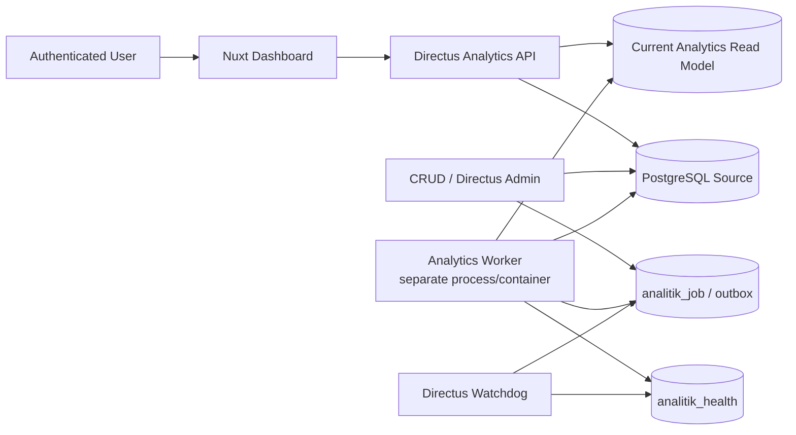

# Operations Runbook — Analitik

**Status:** implemented command paths; runtime/provider evidence remains explicitly gated.

**Evidence vocabulary:** `proven` = deterministic test/receipt exists; `blocked` = required provider/confirmation unavailable; `not runtime-proven` = source and tests pass but ephemeral/production boundary has not been exercised.
**Monitoring MVP yang dipilih:** structured container logs + Directus `analitik_health`

## 1. Arsitektur operasional



Worker harus menjadi process/container terpisah dari Directus. Browser Web Worker atau Node `worker_threads` di proses Directus bukan boundary isolasi yang dipilih.

Pemisahan worker mengurangi beban CPU/serialization pada main process Directus, tetapi tidak menghilangkan beban PostgreSQL. Query tetap memerlukan index, pre-aggregation, cache, timeout, budget, dan benchmark. Read replica/database analitik terpisah adalah roadmap bila diperlukan.

## 2. Consistency model

- CRUD berhasil lebih dahulu.
- Event outbox wajib ditulis atomik dalam transaksi database yang sama dengan perubahan domain. Capture harus meliputi jalur Directus, import, dan raw SQL yang sah; database trigger atau explicit same-transaction write dipilih saat implementasi. After-action hook/network call saja tidak memenuhi no-event-loss guarantee.
- Worker memproyeksikan perubahan ke current read model maksimal 60 detik.
- Read model yang parsial/tidak lolos validasi tidak boleh menjadi active version.
- Saved analysis selalu membaca current active version.
- Tidak ada histori/tren pada MVP target.

Jika Directus extension tidak dapat membuat transaksi domain dan outbox atomik, gunakan database trigger/change capture yang mencakup semua write path. Reconciliation tetap menjadi safety net, bukan pengganti transactional capture.

## 3. `analitik_job`

### Job types

- `project_record_change`
- `refresh_aggregate`
- `rebuild_current_model`
- `reconcile`
- `sync_field_registry`
- `export_csv`
- `export_png`
- `export_pdf`

### Fields minimum

| Field | Tujuan |
|---|---|
| `id` | UUID job |
| `job_type` | Jenis pekerjaan |
| `dedupe_key` | Idempotency/coalescing key |
| `entity_collection`, `entity_id` | Referensi aman tanpa payload PII |
| `status` | `queued`, `processing`, `retry_wait`, `completed`, `dead` |
| `priority` | Prioritas |
| `attempts`, `max_attempts` | Retry control |
| `available_at` | Waktu boleh diproses |
| `locked_at`, `locked_by` | Worker lease |
| `started_at`, `finished_at` | Durasi |
| `checkpoint` | Resume cursor yang aman |
| `correlation_id` | Trace lintas proses |
| `error_code`, `error_summary` | Error tersanitasi |
| `payload_hash` | Verifikasi/idempotency tanpa payload mentah |

### Claim query

Worker mengklaim batch dalam transaksi singkat dengan `SELECT … FOR UPDATE SKIP LOCKED`, lalu `UPDATE … SET status = 'processing', locked_at = NOW(), locked_by = :worker RETURNING …` dan segera commit. Kalkulasi dilakukan setelah claim transaction selesai sehingga row lock tidak ditahan sepanjang pekerjaan.

Job lease harus dapat dipulihkan jika process mati. Heavy rebuild tidak boleh berjalan paralel tanpa leader/advisory lock.

## 4. Idempotency dan coalescing

- Menjalankan job yang sama dua kali menghasilkan current state yang sama.
- `dedupe_key` berbasis jenis job + entity/version.
- Beberapa update cepat terhadap satu usaha boleh dicoalesce menjadi proyeksi state terakhir.
- Projection tidak memakai delta non-idempotent tanpa ledger/version guard.
- Export job tidak dicoalesce lintas pengguna/config kecuali checksum dan permission sama.
- Record archive/restore memproyeksikan status terbaru.

## 5. Cache dan read-model generation

Jika cache diterapkan, key wajib mencakup:

- canonical validated query;
- active read-model generation;
- registry/schema version;
- permission/privacy/masking version;
- locale/format bila memengaruhi payload.

Promotion generation menginvalidasi namespace cache lama. In-process cache hanya aman untuk satu instance dan tidak boleh diasumsikan shared; scale-out memerlukan shared cache atau generation-aware recomputation. Cache tidak boleh membocorkan response lintas permission/session.

## 6. Retry dan dead job

Baseline:

1. Retry eksponensial maksimal lima kali.
2. Tambahkan jitter agar retry tidak serempak.
3. Setelah batas, status menjadi `dead`.
4. Buat/update incident tersanitasi di `analitik_health`.
5. Job dapat direplay manual setelah root cause diperbaiki.
6. Replay mempertahankan correlation chain dan audit.
7. Satu poison job tidak memblokir seluruh queue.

Contoh backoff awal: 10 detik, 30 detik, 2 menit, 5 menit, 15 menit. Nilai final harus disetel dari benchmark dan RTO.

## 7. `analitik_health`

Satu collection menyatukan health dan incident sesuai keputusan produk.

### Record types

#### `component_status`

Satu row per komponen, di-upsert:

- `component`: `worker`, `analytics_api`, `read_model`, `reconciliation`;
- `status`: `healthy`, `degraded`, `down`, `unknown`;
- `last_heartbeat_at`;
- `last_success_at`;
- `queue_depth`;
- `oldest_job_age_seconds`;
- `freshness_lag_seconds`;
- `summary` tersanitasi.

Heartbeat tidak menambah row tanpa batas.

#### `incident`

- `fingerprint` untuk deduplikasi;
- `component`, `severity` (`warning`, `critical`);
- `status` (`open`, `acknowledged`, `resolved`);
- `first_seen_at`, `last_seen_at`;
- `occurrence_count`;
- `summary`, `error_code`, `correlation_id`;
- `resolved_at`, `resolution_summary`.

Incident serupa meng-update row/fingerprint yang sama. Recovery menandai resolved; tidak perlu collection incident terpisah.

#### `reconciliation`

- sumber dan active read-model version;
- total/subtotal yang dibandingkan;
- diff counts;
- start/end/duration;
- `passed`;
- correlation ID.

## 8. Watchdog

Directus scheduled watchdog memeriksa:

- worker heartbeat;
- queue depth;
- oldest job age;
- freshness lag;
- reconciliation terakhir;
- stuck leases.

Watchdog dapat mendeteksi worker mati ketika Directus/PostgreSQL masih tersedia. Ia **tidak** dapat mendeteksi matinya Directus atau PostgreSQL sendiri. Karena external monitoring ditolak untuk MVP, target RTO tertentu tidak dapat dijamin end-to-end; ini adalah accepted risk dan harus tetap terlihat pada ADR.

## 9. Structured logs

Format JSON minimal:

```json
{
  "timestamp": "...",
  "level": "error",
  "service": "analytics-worker",
  "event": "job_failed",
  "jobType": "project_record_change",
  "jobId": "uuid",
  "correlationId": "uuid",
  "attempt": 3,
  "durationMs": 1200,
  "errorCode": "DB_TIMEOUT"
}
```

Dilarang mencatat:

- access/static/refresh token;
- password;
- NIK/telepon;
- raw request/body/source row;
- signed URL;
- SQL dengan bound values sensitif;
- stack trace yang belum disanitasi.

Retention:

- log operasional: 30 hari;
- audit CRUD/login/config/export: satu tahun.

Docker logging driver/rotation, disk budget, access, dan backup harus dikonfigurasi serta diuji; menulis target retensi tanpa rotation/storage bukan bukti retensi.

## 10. Signals wajib

Walaupun stack yang dipilih hanya logs/internal collection, implementasi harus menghasilkan signal berikut:

- queue depth dan umur job tertua;
- job success/failure/retry/dead;
- job duration p50/p95/p99;
- freshness lag;
- cache hit/miss bila cache diterapkan;
- query duration/timeout/lock;
- API latency dan 4xx/5xx;
- login failure count tanpa identifier mentah;
- field registry sync failure;
- reconciliation diff;
- export failure/expiry;
- last-known-good version.

Signal penting diringkas ke `analitik_health`; detail tetap di structured logs.

## 11. Threshold incident

Baseline:

| Kondisi | Severity |
|---|---|
| Oldest job >60 detik | Warning |
| API p95 >3 detik selama 5 menit | Warning |
| Oldest job >5 menit | Critical |
| Worker heartbeat terlewat | Critical |
| Reconciliation diff ≠0 | Critical |
| Error rate >5% | Critical |
| Insiden belum pulih setelah 10 menit | RTO risk |

Tidak ada push channel pada MVP. Pengguna/administrator memeriksa Directus berkala. Konsekuensi: time-to-detect mengikuti frekuensi pemeriksaan kecuali watchdog internal mendeteksi kondisi.

## 12. Degraded mode

### Worker down

- Directus API tetap melayani last-known-good read model.
- Canvas menampilkan pesan nonteknis stale.
- CRUD tidak dibatalkan.
- Queue terus menampung event selama database tersedia.

### Projection/reconciliation failure

- Jangan aktifkan candidate version.
- Pertahankan active last-good version.
- Catat incident dan diff.
- Retry/rebuild setelah root cause diperbaiki.

### Analytics API down

- Nuxt menampilkan error umum dan retry.
- Jangan fallback ke raw source query dari browser.

### PostgreSQL/Directus down

- Internal health collection tidak dapat menerima event.
- Recovery mengikuti restore/service runbook.
- Tanpa monitor eksternal, deteksi bergantung pada pemeriksaan manusia/infrastruktur lain.

## 13. RTO/RPO baseline

| Scope | Target |
|---|---:|
| Worker ordinary failure | RTO ≤15 menit |
| Analytics API failure | RTO ≤1 jam |
| Full platform failure | RTO ≤4 jam |
| CRUD event ketika PostgreSQL selamat | Pipeline RPO 0 melalui transactional outbox |
| Total database loss | RPO ≤15 menit dengan WAL/PITR |

Catatan:

- Pipeline RPO 0 tidak sama dengan infrastructure RPO 0.
- Database disaster RPO ≤15 menit mensyaratkan WAL archiving/PITR yang benar-benar dikonfigurasi dan diuji.
- RTO adalah target, bukan jaminan, terutama karena tidak ada external monitoring pada MVP.

## 14. Reconciliation

Jalankan harian dan setelah rebuild/publish:

1. `COUNT DISTINCT usaha.id` source scope versus read model.
2. Region buckets + unmapped versus total.
3. Scale buckets + unknown versus total.
4. KBLI mapped + unmapped versus total.
5. Archived/active semantics.
6. PII schema/leakage guard.
7. Field registry source versus Directus schema.

Diff apa pun menahan aktivasi candidate version dan mencatat `analitik_health(record_type='reconciliation')` plus incident dedupe.

## 15. Rebuild current model

1. Buat candidate version/table; jangan truncate active public table.
2. Baca source secara bounded/batched.
3. Bangun aggregate/index candidate.
4. Jalankan invariant dan reconciliation.
5. Jika lulus, switch active version secara atomik.
6. Simpan previous last-good untuk rollback singkat.
7. Bersihkan old version berdasarkan retention setelah aman.

Desain ini mengganti pola full truncate yang dapat memblokir pembacaan.

## 16. Incident procedures

### Queue backlog

1. Periksa `analitik_health` dan structured logs via correlation ID.
2. Bedakan slow query, locked lease, poison job, atau worker resource exhaustion.
3. Hentikan heavy rebuild bila mengganggu CRUD/API.
4. Replay dead job setelah fix.
5. Pastikan freshness kembali ≤60 detik.
6. Jalankan reconciliation.
7. Isi resolution summary tanpa PII.

### Reconciliation mismatch

1. Jangan publish candidate.
2. Identifikasi dimensi pertama yang berbeda.
3. Periksa join multiplicity, archive, null/unmapped, dan registry type change.
4. Rebuild dari source.
5. Publish hanya setelah zero diff/invariant yang disepakati.

### Field registry failure

1. Quarantine field terkait.
2. Pertahankan field lain aktif.
3. Validasi create/rename/type/delete event.
4. Migrasikan saved configs atau tandai unavailable.
5. Rebuild cache/aggregate terkait.

### PII leak suspicion

1. Cabut link export/session terkait.
2. Hentikan endpoint/field terdampak.
3. Rotasi credential bila mungkin terpapar.
4. Simpan bukti terkontrol tanpa menyalin PII ke incident/log.
5. Perbaiki server-side masking dan jalankan leakage test.

## 17. Backup dan restore

Untuk memenuhi RPO database:

- backup base + WAL/PITR;
- backup konfigurasi Directus, registry, views, job/health audit sesuai retention, dan object storage;
- enkripsi dan batasi akses backup;
- uji restore berkala ke lingkungan terisolasi;
- ukur waktu restore terhadap RTO;
- setelah restore, replay outbox lalu rebuild/reconcile read model;
- jangan menganggap backup valid sebelum restore drill berhasil.

## 18. Deployment checklist

- ACME/TLS private key dan runtime Caddy tidak ter-track; key yang pernah terpapar sudah dirotasi;
- PostgreSQL, MinIO, MinIO Console, dan Directus admin port tidak memiliki public ingress tanpa control eksplisit;
- private `/panel/assets` tidak memakai public CacheFirst PWA cache;
- migration reversible/backup tersedia;
- worker version kompatibel dengan schema version;
- candidate read model dibangun dan direkonsiliasi;
- route/API authentication tests lulus;
- field registry sync tests lulus;
- PII leakage tests lulus;
- performance benchmark lulus;
- last-known-good rollback diuji;
- watchdog heartbeat terlihat;
- credential tidak masuk image/log/docs.


## 19. Implemented command paths and evidence fields

| Area | Command | Evidence/status |
|---|---|---|
| Worker | `cd services/analytics-worker && pnpm test` | deterministic tests / `proven` when receipt is attached |
| API | `cd services/directus/extensions/directus-extension-analitik && pnpm run build && pnpm test` | contract tests / `proven` |
| Leak scan | `python3 scripts/scan-analytics-leaks.py --fixture-root apps/web/test-results` | zero hits required / `not runtime-proven` until artifact run |
| WAL/base | `docker/wal-g-backup.sh` | off-host target and provider credential required / `blocked` locally |
| PITR | `CONFIRM_PITR_RESTORE=isolated-test ... docker/restore-pitr.sh` | never source directory; isolated target only / `blocked` without confirmation |
| Object restore | `CONFIRM_OBJECT_RESTORE=isolated-test ... docker/object-storage-restore.sh` | production bucket refusal / `blocked` without off-host provider |

Record each release receipt with: UTC start/end, image digest, schema/registry/masking version, active/previous generation, queue/freshness, benchmark p50/p95/p99, leak-scan count, backup-list timestamp, restore target, RPO/RTO measurement, operator, and rollback decision. Never put cookies, credentials, signed URLs, raw PII, or dumps in the receipt.

## 20. Capacity and accepted blind spot

Docker `local` logs are bounded at 10 MiB × 3 per service. Measure daily compressed volume from the running stack, multiply by 30 and add 25% margin; release blocks if the result exceeds allocated capacity rather than silently reducing retention. Internal watchdog detects worker/queue/read-model failures only. A total Directus/PostgreSQL outage requires an external infrastructure monitor and remains an accepted monitoring blind spot; the ≤4 hour full-platform RTO is a target, not a guarantee.
