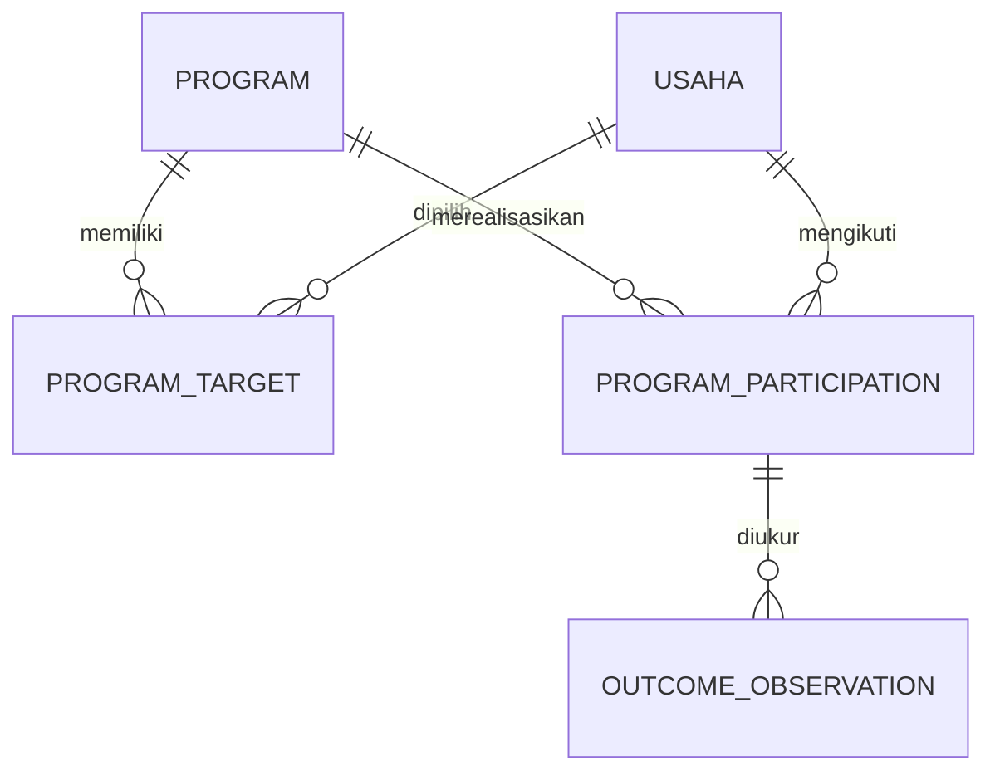

# Roadmap Analitik

**Status:** product/architecture roadmap; bukan komitmen tanggal
**Pekerjaan saat ini:** dokumentasi saja

## Phase 0 — Security dan data readiness gate

Wajib selesai sebelum UI baru dianggap aman:

- hapus endpoint dashboard publik dan enforce Directus accountability;
- implementasikan login/session/logout sebenarnya;
- buat Application User least-privilege dan break-glass Admin;
- tangani credential/certificate material yang ter-track dan rotasi key terdampak;
- batasi port database, object storage, dan Directus dari ingress publik;
- konfigurasikan archive semantics pada `usaha`;
- validasi KBLI unclassified dan workforce semantics;
- perbaiki ingestion agar update source yang sah benar-benar memperbarui current state;
- ulangi data-validation gate dan benchmark.

## Phase 1 — Current-state Analytics foundation

Target:

- PostgreSQL transactional outbox;
- worker process/container terpisah;
- versioned/shadow current read model;
- `analitik_field`, `analitik_job`, `analitik_health`, `analitik_view`;
- server-side query AST, allowlist, budget, dan masking;
- reconciliation dan last-known-good;
- structured logs dan internal watchdog;
- private API contract tests.

Acceptance utama:

- source/read model reconcile;
- CRUD-to-visible ≤60 detik;
- worker kill/reclaim/replay lulus;
- API/query p95 memenuhi SLO;
- schema mutation matrix lulus;
- tidak ada PII leakage.

## Phase 2 — Analytics canvas

Target:

- `/dashboard/analitik` single canvas;
- templates, query builder, dynamic filters;
- KPI, bar/stacked, donut, histogram, choropleth, table;
- cross-filter, drill-down, comparison current state;
- transparent deterministic insights;
- saved analysis yang selalu memakai current data;
- CSV/PNG/PDF export job;
- responsive dan WCAG 2.1 AA.

## Phase 3 — Profil UMKM dan operational CRUD

Target profil:

- `/dashboard/umkm/:id` rich profile;
- dynamic section rendering;
- masked personal data;
- location/business/financial/workforce/quality sections;
- return-to-analysis state;
- Archive/Restore, PDF, previous/next.

Target CRUD terpisah:

- dynamic form berdasarkan schema/metadata;
- server validation;
- raw PII hanya pada experience yang berizin;
- conflict/version handling;
- audit/revision privacy review;
- outbox coverage untuk Directus, import, dan raw SQL path.

Halaman CRUD lengkap bukan scope spesifikasi MVP saat ini, tetapi arsitektur Phase 1 tidak boleh memblokirnya.

## Phase 4 — External reliability dan scale isolation

Trigger untuk fase ini:

- internal/manual monitoring tidak memenuhi RTO;
- PostgreSQL query Analitik mengganggu CRUD;
- backlog melanggar freshness SLO;
- satu Directus instance/cache tidak cukup.

Candidate improvements:

- external uptime monitor dan push channel;
- OpenTelemetry/Prometheus/Grafana/Loki atau hosted APM;
- Redis/BullMQ bila PostgreSQL queue tidak memadai;
- read replica/read-only DB role;
- database analitik/OLAP terpisah;
- shared cache keyed by read-model generation;
- multi-worker autoscaling dengan bounded concurrency.

## Phase 5 — History dan tren

Syarat sebelum line chart/tren:

- event time/as-of semantics yang sah;
- source update time dipersist;
- versioned historical facts atau periodic snapshots;
- identity/dedupe/change policy;
- late-arriving correction policy;
- retention dan backfill;
- metric comparability antarperiode.

Setelah itu baru boleh menambahkan:

- perubahan periode;
- cohort usia usaha;
- trend geography/KBLI/scale;
- explicit revised-data marker.

Current database insertion time tidak boleh dijadikan event time bisnis secara diam-diam.

## Phase 6 — Program dan outcome DSS

Model masa depan:

### Entitas

- `program` — tujuan, periode, owner, eligibility, target.
- `program_target` — kandidat/sasaran dan alasan seleksi.
- `program_participation` — realisasi keterlibatan/status.
- `outcome_observation` — metrik, baseline, waktu observasi, sumber, nilai.

Syarat klaim dampak:

- outcome terdefinisi;
- baseline dan waktu observasi;
- coverage/attrition;
- attribution method yang sesuai;
- perubahan data teraudit.

Tanpa itu, UI hanya boleh menyatakan partisipasi atau perubahan teramati, bukan dampak kausal.

## Explicit non-roadmap defaults

Fitur berikut tidak otomatis menjadi prioritas hanya karena mungkin:

- AI generatif yang menulis rekomendasi;
- public share link;
- social feed/like/comment/follow;
- multi-widget free-form dashboard builder;
- unrestricted cross-collection joins;
- export seluruh 5,4 juta row melalui browser;
- jutaan exact points pada canvas Analitik.
